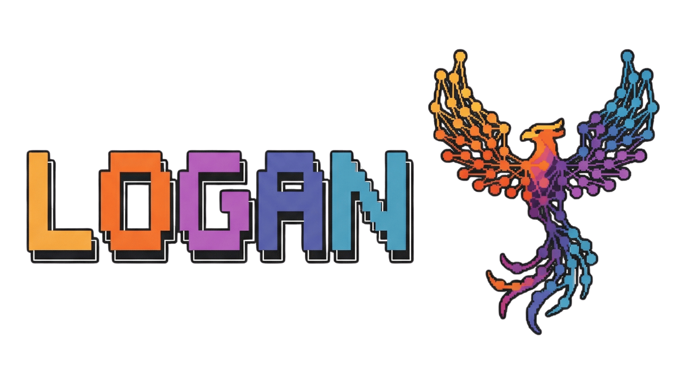

# LOGAN - סוכן AI לקוד שעובד עם כל מודל שתרצו 🚀

<p align="center">
  
</p>

> **TL;DR:** Logan הוא סוכן AI לכתיבת קוד שרץ בטרמינל - בדיוק כמו Claude Code, רק שהוא קוד פתוח לחלוטין ועובד עם כל ספק LLM שתרצו. מבוסס על OpenCode.

---

## 🏃 Quick Start - איך להתקין ולהריץ את Logan

### אפשרות 1: npm / npx / bun (הכי קל! 🎉)

```bash
# Install globally with npm
npm install -g logan-ai

# Or with bun
bun add -g logan-ai

# Or run directly without installing
npx logan-ai

# Then just run:
logan
```

### אפשרות 2: Development Mode (לפיתוח/תרומה)

```bash
# שלב 1: Clone the repo
git clone https://github.com/hoodini/logan.git
cd logan

# שלב 2: Install dependencies (צריך Bun 1.3+)
bun install

# שלב 3: Run Logan!
bun dev
```

### אפשרות 3: Build Standalone Binary

```bash
# Build for your current OS
cd packages/opencode
bun run script/build.ts --single

# Run the built binary
# Windows:
.\dist\logan-windows-x64\bin\logan.exe

# macOS (Apple Silicon):
./dist/logan-darwin-arm64/bin/logan

# macOS (Intel):
./dist/logan-darwin-x64/bin/logan

# Linux:
./dist/logan-linux-x64/bin/logan
```

---

## 🖥️ IDE Integration - שילוב עם סביבת הפיתוח

### VS Code
```bash
# Run Logan in VS Code terminal
# 1. Open terminal (Ctrl+`)
# 2. Navigate to your project
cd /path/to/your/project

# 3. Run Logan
logan    # if installed via npm/bun
# or
bun dev  # if in logan repo for development
```

### JetBrains IDEs (IntelliJ, WebStorm, PyCharm)
```bash
# Same as VS Code - open terminal and run
logan
```

### Neovim / Vim
```bash
# Run in a terminal split or use :terminal
:terminal logan
```

### Any Terminal
Logan works in **any terminal** on **any OS**:
- ✅ Windows: PowerShell, CMD, Windows Terminal, Git Bash
- ✅ macOS: Terminal.app, iTerm2, Kitty, Warp, WezTerm
- ✅ Linux: GNOME Terminal, Konsole, Alacritty, Kitty

---

## 🌍 Cross-Platform Support

| Platform | Status | Terminal Image |
|----------|--------|----------------|
| **Windows x64** | ✅ Full Support | ASCII fallback |
| **macOS Apple Silicon** | ✅ Full Support | ✅ iTerm2/Kitty |
| **macOS Intel** | ✅ Full Support | ✅ iTerm2/Kitty |
| **Linux x64** | ✅ Full Support | ✅ Sixel/Kitty |
| **Linux ARM64** | ✅ Full Support | ✅ Sixel/Kitty |

---

## מה זה בכלל? בואו נפרק את זה 🤔

מסתבר שהרבה מפתחים מחפשים כלי AI לקידוד שלא יהיה תלוי בספק יחיד. הריפו הזה פותר בדיוק את הבעיה הזו.

Logan is an open-source AI coding agent that runs directly in your terminal. Think of it as Claude Code or GitHub Copilot Chat, but with these key differences:

- **100% קוד פתוח** - תוכלו לקרוא כל שורת קוד
- **לא תלוי בספק אחד** - עובד עם Claude, OpenAI, Google, מודלים לוקאליים, ועוד
- **תמיכה מובנית ב-LSP** - מבין את הקוד שלכם ברמה עמוקה
- **ארכיטקטורת Client/Server** - אפשר להריץ על המחשב ולשלוט מרחוק מהטלפון!

```
┌─────────────────────────────────────────────────────────────────────┐
│                          LOGAN Architecture                          │
├─────────────────────────────────────────────────────────────────────┤
│                                                                     │
│   ┌──────────┐     ┌──────────────┐     ┌──────────────────────┐   │
│   │  אתם     │────▶│    LOGAN     │────▶│   LLM Provider       │   │
│   │ (Terminal)│     │   (Agent)    │     │   (Your Choice!)     │   │
│   └──────────┘     └──────────────┘     └──────────────────────┘   │
│                           │                        │               │
│                           │              ┌─────────┴────────┐      │
│                           ▼              │                  │      │
│                    ┌──────────────┐      ▼                  ▼      │
│                    │   הקוד שלכם   │   Claude           OpenAI     │
│                    │   (Local)    │   Anthropic         GPT-4     │
│                    └──────────────┘   Gemini            Local     │
│                                       Bedrock           Ollama    │
│                                       Copilot           LM Studio │
│                                                                    │
└─────────────────────────────────────────────────────────────────────┘
```

---

## 🔒 בדיקת אבטחה - לאן נשלחים הפרומפטים שלכם?

שורה תחתונה אחרי שסרקתי את כל הקוד:

### ✅ מה כן נשלח (רק לספק שאתם בוחרים):
- **הפרומפטים שלכם** - נשלחים רק לספק ה-LLM שאתם מגדירים (Claude, OpenAI, וכו')

### ⚠️ שירותים אופציונליים (אפשר לכבות):
| שירות | כתובת | מה זה עושה | איך לכבות |
|--------|-------|-----------|-----------|
| Share | `api.opencode.ai` | שיתוף סשנים | `OPENCODE_DISABLE_SHARE=true` |
| Web Search | `mcp.exa.ai` | חיפוש באינטרנט | מבקש אישור לפני כל שאילתה |
| Code Search | `mcp.exa.ai` | חיפוש קוד/דוקומנטציה | מבקש אישור לפני כל שאילתה |

### ✅ מה לא נשלח:
- **אין טלמטריה** - OpenTelemetry הוא opt-in בלבד
- **אין tracking** - לא נשלח שום מידע לספק צד שלישי ללא הסכמה מפורשת

---

## 🚀 התקנה - 3 דקות ואתם באוויר

### הדרך המהירה - מ-Source:
```bash
# 1. Clone
git clone https://github.com/hoodini/logan.git
cd logan

# 2. Install (requires Bun 1.3+)
# Install Bun first if needed: https://bun.sh
bun install

# 3. Run!
bun dev
```

### Build Standalone Executable:
```bash
cd packages/opencode
bun run script/build.ts --single

# Binary will be in dist/ folder
```

---

## 🔧 הגדרת ספק LLM - Step by Step

### אפשרות 1: GitHub Copilot Subscription (מומלץ אם יש לכם!)

הקטע המדליק הוא שאם כבר יש לכם מנוי Copilot, אתם יכולים להשתמש בו בחינם!

```bash
# שלב 1: התחברות
logan auth login github-copilot

# שלב 2: הגדרת המודל ב-opencode.json
```

צרו קובץ `opencode.json` בתיקיית הפרויקט:
```json
{
  "$schema": "https://opencode.ai/config.json",
  "provider": {
    "github-copilot": {}
  },
  "model": "github-copilot/gpt-4o"
}
```

**פלט לדוגמה:**
```
✓ Successfully authenticated with GitHub Copilot
✓ Available models: gpt-4o, gpt-4o-mini, claude-3.5-sonnet
```

---

### אפשרות 2: OpenAI (ChatGPT)

```bash
# שלב 1: הוספת API Key
logan auth add openai
# יבקש מכם להדביק את ה-API Key מ-platform.openai.com
```

קובץ `opencode.json`:
```json
{
  "$schema": "https://opencode.ai/config.json",
  "model": "openai/gpt-4o"
}
```

או דרך Environment Variable:
```bash
export OPENAI_API_KEY="sk-..."
```

---

### אפשרות 3: Claude (Anthropic)

```bash
# שלב 1: הוספת API Key
logan auth add anthropic
```

קובץ `opencode.json`:
```json
{
  "$schema": "https://opencode.ai/config.json",
  "model": "anthropic/claude-sonnet-4-20250514"
}
```

או דרך Environment Variable:
```bash
export ANTHROPIC_API_KEY="sk-ant-..."
```

---

### אפשרות 4: מודלים לוקאליים (Ollama) 🏠

פסיכי - אפשר להריץ הכל לוקאלית בלי לשלוח שום דבר לענן!

```bash
# שלב 1: התקנת Ollama (אם עוד לא מותקן)
# Windows: winget install Ollama.Ollama
# macOS: brew install ollama
# Linux: curl -fsSL https://ollama.com/install.sh | sh

# שלב 2: משיכת מודל
ollama pull qwen2.5-coder:32b
# או מודל קטן יותר: ollama pull qwen2.5-coder:7b

# שלב 3: הרצת Ollama
ollama serve
```

קובץ `opencode.json`:
```json
{
  "$schema": "https://opencode.ai/config.json",
  "provider": {
    "ollama": {
      "api": "http://localhost:11434/v1",
      "models": {
        "qwen2.5-coder:32b": {
          "name": "Qwen 2.5 Coder 32B"
        }
      }
    }
  },
  "model": "ollama/qwen2.5-coder:32b"
}
```

---

### אפשרות 5: LM Studio 🖥️

אם אתם משתמשים ב-LM Studio:

```bash
# שלב 1: פתחו את LM Studio והפעילו את השרת
# בדרך כלל רץ על http://localhost:1234

# שלב 2: הגדירו את opencode.json
```

```json
{
  "$schema": "https://opencode.ai/config.json",
  "provider": {
    "lm-studio": {
      "api": "http://localhost:1234/v1",
      "models": {
        "local-model": {
          "name": "Your Local Model"
        }
      }
    }
  },
  "model": "lm-studio/local-model"
}
```

---

### אפשרות 6: Google Gemini

```bash
export GOOGLE_GENERATIVE_AI_API_KEY="your-key"
```

```json
{
  "$schema": "https://opencode.ai/config.json",
  "model": "google/gemini-2.5-pro-preview"
}
```

---

### אפשרות 7: AWS Bedrock

```bash
# הגדרת AWS Credentials
export AWS_ACCESS_KEY_ID="..."
export AWS_SECRET_ACCESS_KEY="..."
export AWS_REGION="us-east-1"
```

```json
{
  "$schema": "https://opencode.ai/config.json",
  "model": "amazon-bedrock/anthropic.claude-sonnet-4-20250514-v1:0"
}
```

---

## 💻 שימוש בסיסי

```bash
# פתחו טרמינל בתיקיית הפרויקט והריצו:
logan

# זהו! עכשיו אתם יכולים לשאול שאלות על הקוד שלכם
```

### פקודות שימושיות:
| פקודה | מה זה עושה |
|--------|-----------|
| `Tab` | מעבר בין סוכנים (build / plan) |
| `/help` | עזרה |
| `/clear` | ניקוי היסטוריה |
| `/model` | החלפת מודל |
| `Ctrl+C` | יציאה |

---

## 🎯 Use Cases - דוגמאות מעשיות

### Use Case 1: Debug באג מציק
```
אתם: "יש לי באג בקובץ auth.ts - המשתמשים לא מצליחים להתחבר אחרי refresh token"

Logan: *קורא את הקוד, מנתח את הבעיה*
"מצאתי את הבעיה! ב-auth.ts שורה 47, אתם מנסים לרענן את הטוקן אבל לא מחכים
לתשובה מהשרת. הנה התיקון..."
```

### Use Case 2: הוספת פיצ'ר חדש
```
אתם: "תוסיף dark mode לאפליקציה"

Logan: *סורק את הפרויקט*
"אני רואה שאתם משתמשים ב-Tailwind CSS. אני אצור context לניהול הtheme,
אוסיף toggle button, ואעדכן את ה-tailwind.config..."
*יוצר/עורך קבצים אוטומטית*
```

### Use Case 3: הבנת קוד קיים
```
אתם: "תסביר לי איך עובד ה-payment flow בפרויקט"

Logan: *קורא את הקבצים הרלוונטיים*
"הפיימנט פלואו עובד ככה:
1. המשתמש לוחץ על 'Pay' ב-checkout.tsx
2. נשלחת קריאה ל-/api/payment שב-payment.ts
3. שם מתבצעת אינטגרציה עם Stripe...
רוצים שאצור דיאגרמה?"
```

---

## 📊 דיאגרמת Flow

```
┌──────────────────────────────────────────────────────────────────┐
│                          LOGAN Workflow                           │
└──────────────────────────────────────────────────────────────────┘

     ┌─────────┐         ┌──────────┐         ┌──────────┐
     │  Input  │         │  Agent   │         │   LLM    │
     │  Prompt │────────▶│ Analysis │────────▶│ Provider │
     └─────────┘         └──────────┘         └──────────┘
                               │                    │
                               │                    │
                               ▼                    │
                         ┌──────────┐               │
                         │   LSP    │               │
                         │ Analysis │               │
                         │ (Code    │               │
                         │ Context) │               │
                         └──────────┘               │
                               │                    │
                               │                    │
                               ▼                    ▼
                         ┌──────────────────────────────┐
                         │      Response + Actions       │
                         │   (Read/Write/Execute/etc.)   │
                         └──────────────────────────────┘
                                       │
                                       ▼
                         ┌──────────────────────────────┐
                         │        Your Codebase         │
                         │    (Files Modified/Created)   │
                         └──────────────────────────────┘
```

---

## 🔐 הגדרות אבטחה מומלצות

אם אתם רוצים שום קריאה לשרתים חיצוניים (חוץ מה-LLM שלכם):

```bash
# כבו את פיצ'ר השיתוף
export OPENCODE_DISABLE_SHARE=true
```

---

## 📚 Agents מובנים

LOGAN מגיע עם שני סוכנים שאפשר לעבור ביניהם עם `Tab`:

| Agent | תיאור | מתי להשתמש |
|-------|--------|-----------|
| **build** | גישה מלאה - קריאה, כתיבה, הרצת פקודות | פיתוח רגיל |
| **plan** | קריאה בלבד, מבקש אישור לפני פעולות | חקירת קוד, תכנון |

---

## 🆚 מה ההבדל מ-Claude Code?

| פיצ'ר | Claude Code | LOGAN |
|--------|-------------|----------|
| קוד פתוח | ❌ | ✅ 100% |
| בחירת ספק LLM | ❌ (רק Claude) | ✅ כל ספק |
| מודלים לוקאליים | ❌ | ✅ Ollama, LM Studio |
| תמיכת LSP מובנית | ❌ | ✅ |
| Desktop App | ❌ | ✅ |
| מחיר | לפי שימוש Claude | לפי הספק שתבחרו |

---

## 🤝 תרומה לפרויקט

רוצים לתרום? מעולה!
קראו את [CONTRIBUTING.md](./CONTRIBUTING.md) לפני שפותחים PR.

---

## 📖 לינקים שימושיים

- 🔗 [LOGAN GitHub](https://github.com/hoodini/logan)
- 📖 [Original OpenCode](https://opencode.ai)
- 🎨 [Curated by YUV.AI](https://yuv.ai)

---

## 🏷️ License

MIT - עשו מה שבא לכם!

---

<p align="center">
  <i>🐺 LOGAN - Your Personal AI Coding Agent</i><br>
  <i>Curated by Yuval Avidani, AI Builder & Speaker, YUV.AI</i><br>
  <i>GitHub Star | AWS GenAI Superstar</i>
</p>
