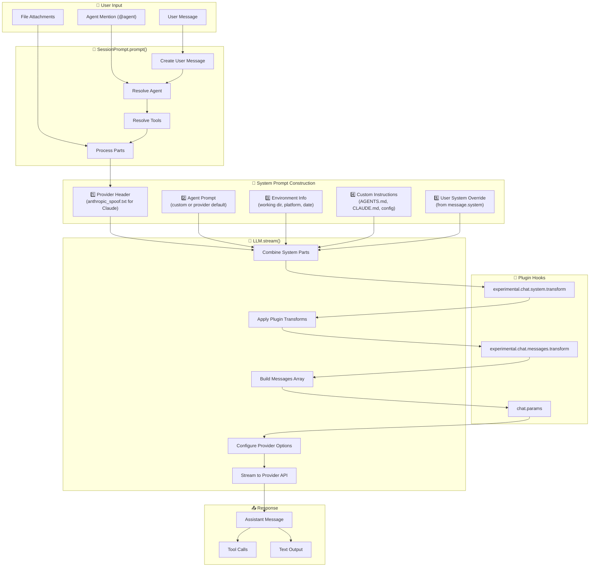

# System Prompt Architecture

This document explains how to customize what instructions the AI coding agent receives, regardless of which LLM provider (Claude, GPT, Gemini, etc.) you use.

---

## TL;DR - The Easiest Way to Customize the System Prompt

**Create an `AGENTS.md` file in your project root.** That's it!

```markdown
# My Project Rules

- Always use TypeScript
- Write tests for every new function
- Follow existing code patterns
- Be concise in explanations
```

This file is automatically included in every prompt sent to the AI, **regardless of which LLM provider you use**.

---

## Overview

When you send a message, OpenCode builds a "system prompt" - the instructions that tell the AI how to behave. Think of it like giving an employee their job description before they start working.

The system prompt is built from multiple sources (in order):

1. **Base instructions** - Built-in rules for being a good coding assistant
2. **Your custom rules** - From `AGENTS.md` or config files
3. **Environment info** - What folder you're in, what OS you're using, etc.

---

## 🎯 How to Set a Universal System Prompt (Works with ALL Providers)

There are 3 easy ways to customize the AI's behavior. **All of these work regardless of whether you use Claude, GPT, Gemini, or any other provider.**

### Option 1: Create an AGENTS.md File (Recommended)

Create a file called `AGENTS.md` in your project's root folder:

```markdown
# Instructions for the AI

You are helping me build a React application.

Rules:
- Use functional components with hooks
- Use Tailwind CSS for styling  
- Always add TypeScript types
- Write unit tests for new functions
```

**That's it!** OpenCode automatically finds this file and includes it in every prompt.

### Option 2: Global Rules (Apply to ALL Projects)

Create `~/.config/opencode/AGENTS.md` (Linux/Mac) or `%USERPROFILE%\.config\opencode\AGENTS.md` (Windows):

```markdown
# My Global Coding Rules

- Be concise, don't over-explain
- Prefer modern JavaScript/TypeScript patterns
- Always handle errors properly
```

These rules apply to every project you work on.

### Option 3: Config File (Most Control)

Add to your `opencode.json`:

```json
{
  "agent": {
    "build": {
      "prompt": "You are a senior developer. Always write clean, tested code. Focus on maintainability."
    }
  }
}
```

Or point to a file:

```json
{
  "agent": {
    "build": {
      "prompt": "{file:./my-instructions.txt}"
    }
  }
}
```

---

## Why This Works with All Providers

When you set a custom `prompt` for an agent, OpenCode uses YOUR prompt instead of the default provider-specific one. Here's the logic:

```
If agent has custom prompt → Use custom prompt
Else → Use provider-specific prompt (Claude/GPT/Gemini defaults)
```

So by setting your own prompt, you bypass all provider-specific behavior and get consistent instructions across all LLMs.

---

## Prompt Flow Diagram



---

## System Prompt Components

The system prompt is constructed in `LLM.stream()` ([packages/opencode/src/session/llm.ts](../src/session/llm.ts)) and consists of these layers:

### 1. Provider Header

Selected based on provider ID in `SystemPrompt.header()`:

```typescript
// packages/opencode/src/session/system.ts
export function header(providerID: string) {
  if (providerID.includes("anthropic")) return [PROMPT_ANTHROPIC_SPOOF.trim()]
  return []
}
```

### 2. Agent/Provider Prompt

The main system prompt, selected in priority order:

1. **Agent custom prompt** - If the agent has a `prompt` configured
2. **Provider-specific prompt** - Based on the model:
   - `anthropic.txt` for Claude models
   - `beast.txt` for GPT-4/o1/o3 models
   - `gemini.txt` for Gemini models
   - `codex.txt` for GPT-5 Codex
   - `qwen.txt` for other models (fallback)

```typescript
// packages/opencode/src/session/system.ts
export function provider(model: Provider.Model) {
  if (model.api.id.includes("gpt-5")) return [PROMPT_CODEX]
  if (model.api.id.includes("gpt-") || model.api.id.includes("o1") || model.api.id.includes("o3"))
    return [PROMPT_BEAST]
  if (model.api.id.includes("gemini-")) return [PROMPT_GEMINI]
  if (model.api.id.includes("claude")) return [PROMPT_ANTHROPIC]
  return [PROMPT_ANTHROPIC_WITHOUT_TODO]
}
```

### 3. Environment Context

Added via `SystemPrompt.environment()`:

```typescript
export async function environment() {
  return [
    `Here is some useful information about the environment you are running in:`,
    `<env>`,
    `  Working directory: ${Instance.directory}`,
    `  Is directory a git repo: ${project.vcs === "git" ? "yes" : "no"}`,
    `  Platform: ${process.platform}`,
    `  Today's date: ${new Date().toDateString()}`,
    `</env>`,
  ].join("\n")
}
```

### 4. Custom Instructions

Loaded from multiple sources via `SystemPrompt.custom()`:

| Source | Location | Priority |
|--------|----------|----------|
| Project rules | `./AGENTS.md`, `./CLAUDE.md` (walks up directory tree) | Highest |
| Global rules | `~/.config/opencode/AGENTS.md` | Medium |
| Claude rules | `~/.claude/CLAUDE.md` | Medium |
| Config instructions | `opencode.json` → `instructions` array | Configurable |

### 5. User System Override

If the user message includes a `system` field, it's appended to the system prompt.

---

## Key Files

| File | Purpose |
|------|---------|
| [src/session/prompt.ts](../src/session/prompt.ts) | Main entry point for processing user prompts |
| [src/session/llm.ts](../src/session/llm.ts) | Constructs system prompt and streams to LLM |
| [src/session/system.ts](../src/session/system.ts) | System prompt utilities and instruction loading |
| [src/agent/agent.ts](../src/agent/agent.ts) | Agent configuration and defaults |
| [src/session/prompt/*.txt](../src/session/prompt/) | Provider-specific base prompts |

---

## How to Customize the System Prompt

### Method 1: Project-level Rules (AGENTS.md)

Create an `AGENTS.md` file in your project root:

```markdown
# Project Instructions

- Always use TypeScript strict mode
- Follow the existing code style
- Write tests for all new functions
- Use ESM imports, not CommonJS
```

OpenCode automatically finds and includes this file in the system prompt.

### Method 2: Global Rules

Create `~/.config/opencode/AGENTS.md` for instructions that apply to all projects:

```markdown
# Global Instructions

- Be concise in explanations
- Prefer functional programming patterns
- Always check for null/undefined
```

### Method 3: Agent-specific Prompts

Configure custom prompts per agent in `opencode.json`:

```json
{
  "agent": {
    "build": {
      "prompt": "{file:./prompts/build-instructions.txt}"
    },
    "review": {
      "prompt": "You are a code reviewer. Focus on security and performance."
    }
  }
}
```

### Method 4: Config Instructions Array

Add multiple instruction sources:

```json
{
  "instructions": [
    "./my-rules.md",
    "https://example.com/team-standards.md",
    "~/shared-instructions.md"
  ]
}
```

### Method 5: Per-message System Override

When using the SDK, you can pass a `system` field:

```typescript
await client.session.prompt({
  sessionID: "...",
  system: "Additional context for this specific request",
  parts: [{ type: "text", text: "User message" }]
})
```

### Method 6: Plugins (Advanced)

Create a plugin to transform the system prompt dynamically:

```typescript
// my-plugin.ts
export default {
  name: "my-prompt-modifier",
  hooks: {
    "experimental.chat.system.transform": async ({ system }) => {
      system.push("Always respond in JSON format")
    }
  }
}
```

---

## Viewing the System Prompt

To see what system prompt is being sent:

1. **Enable debug logging**:
   ```bash
   OPENCODE_LOG_LEVEL=debug opencode
   ```

2. **Check the log files** in `~/.local/share/opencode/log/` (Linux/Mac) or `%LOCALAPPDATA%/opencode/log/` (Windows)

3. **Use a proxy** like mitmproxy to inspect API requests

---

## Prompt Construction Flow (Code Path)

1. **User sends message** → `SessionPrompt.prompt()` is called
2. **Message processing** → `createUserMessage()` resolves file attachments, agents
3. **Loop starts** → `loop()` processes the conversation
4. **System prompt built** in `SessionProcessor.process()` → `LLM.stream()`:
   ```typescript
   const system = SystemPrompt.header(input.model.providerID)
   system.push([
     ...(input.agent.prompt ? [input.agent.prompt] : SystemPrompt.provider(input.model)),
     ...input.system,  // Environment + custom instructions
     ...(input.user.system ? [input.user.system] : []),
   ].join("\n"))
   ```
5. **Plugin transformation** → `experimental.chat.system.transform` hook
6. **Messages sent** → `streamText()` from AI SDK sends to provider

---

## Provider-specific Behavior

| Provider | Header | Base Prompt | Special Handling |
|----------|--------|-------------|------------------|
| Anthropic | `anthropic_spoof.txt` | `anthropic.txt` | Cache-friendly 2-part structure |
| OpenAI | None | `beast.txt` / `codex.txt` | Codex uses `instructions` option |
| Gemini | None | `gemini.txt` | - |
| Others | None | `qwen.txt` | Fallback prompt |

---

## Example: Full System Prompt Structure

For a Claude model with custom AGENTS.md:

```
[Part 1 - Header]
{anthropic_spoof.txt content}

[Part 2 - Combined]
{anthropic.txt - base agent instructions}

Here is some useful information about the environment:
<env>
  Working directory: /home/user/my-project
  Is directory a git repo: yes
  Platform: linux
  Today's date: Mon Jan 19 2026
</env>

Instructions from: /home/user/my-project/AGENTS.md
# Project Rules
- Use TypeScript
- Follow existing patterns
```

---

## See Also

- [Agents Documentation](../../web/src/content/docs/agents.mdx)
- [Permissions Documentation](../../web/src/content/docs/permissions.mdx)
- [Plugin System](../../plugin/README.md)
